<h1 align="center">KnowRL: Boosting LLM Reasoning via Reinforcement Learning<br>with Minimal-Sufficient Knowledge Guidance</h1>

<p align="center">
  <a href="https://arxiv.org/abs/2604.12627"></a>
  &nbsp;
  <a href="https://github.com/HasuerYu/KnowRL"></a>
</p>

<p align="center">
  <a href="#-news">🎉 News</a> •
  <a href="#-overview">📖 Overview</a> •
  <a href="#-getting-started">✨ Getting Started</a> •
  <a href="#-data">📊 Data</a> •
  <a href="#-citation">📌 Citation</a>
</p>

<p align="center">
  <a href="https://huggingface.co/collections/HasuerYu/knowrl"></a>
  <a href="https://huggingface.co/datasets/HasuerYu/KnowRL-Train-Data"></a>
  <a href="https://huggingface.co/datasets/HasuerYu/KnowRL-KP-Annotations"></a>
  <a href="https://huggingface.co/HasuerYu/KnowRL-Nemotron-1.5B"></a>
</p>

---

## 🎉 News

- **[2026-04-16]** KnowRL ranks **#1** on Hugging Face Daily Papers! Check it out: [Daily Paper](https://huggingface.co/papers/2604.12627).
- **[2026-04-15]** We release our paper, code, training data, KP annotations, and model checkpoints. Check it out: [Paper](https://arxiv.org/abs/2604.12627).

---

## 📖 Overview

Hint-based reinforcement learning (RL) addresses **reward sparsity** in LLM reasoning by injecting auxiliary guidance into prompts. However, existing methods suffer from **hint redundancy** — they inject excessive or loosely structured guidance while only a small subset of information is actually needed. We identify three key challenges:

<p align="center">
  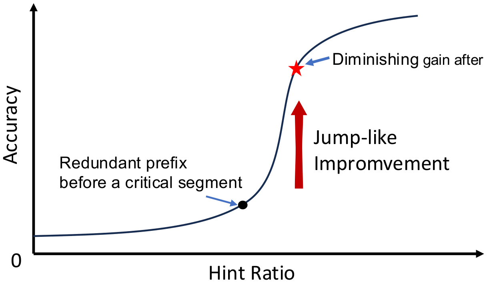
  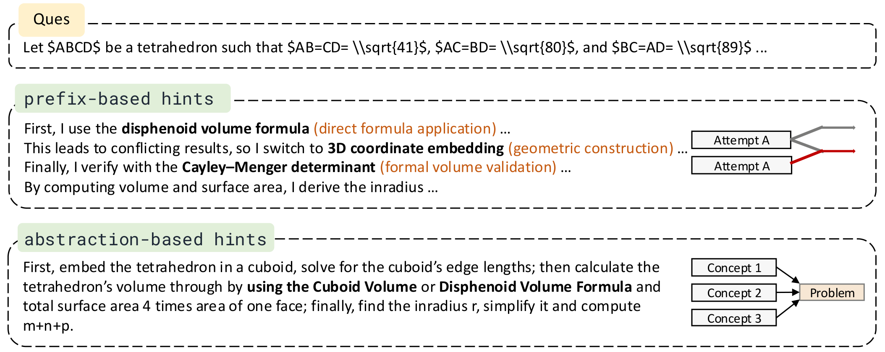
  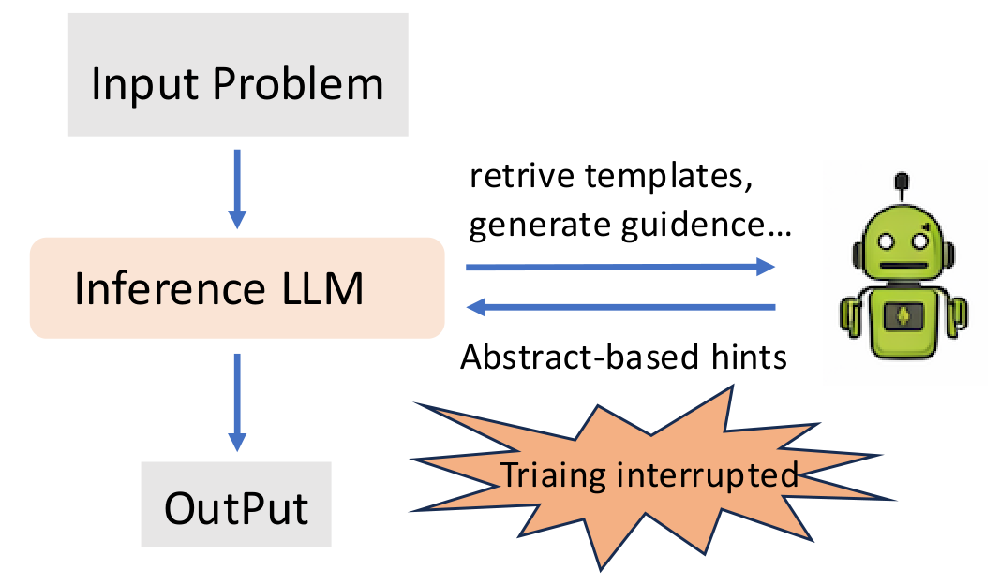
</p>
<p align="center">
  <b>Figure 1.</b> Three key challenges in hint-based RL. (a) The <i>critical-segment effect</i>: performance improves sharply once a short key hint segment appears, with diminishing returns beyond it. (b) <i>Cross-hint inconsistency</i>: longer prefixes may introduce branching or ambiguity. (c) <i>Training-efficiency trade-off</i>: abstraction-based hints rely on teacher models, increasing computational overhead.
</p>

**KnowRL** formulates hint design as a **minimal sufficient guidance problem**. Instead of injecting long solution prefixes or full reasoning templates, KnowRL decomposes guidance into atomic **knowledge points (KPs)** and identifies the **minimal subset** required to unlock reward learning.

### Key Contributions

1. **Minimal-sufficiency perspective on hint-based RL** — We empirically demonstrate a non-linear, jump-like performance pattern (critical-segment effect), revealing that effective guidance depends on selective key knowledge rather than cumulative hint length.

2. **Principled KP selection pipelines** — We design several KP selection strategies (S-LOO, T-LOO, CBRS, CSS) that ensure minimal, non-redundant, and interaction-compatible KP subsets. CSS achieves the best performance with **~38% fewer KPs**.

3. **State-of-the-art results at 1.5B scale** — KnowRL-Nemotron-1.5B achieves **74.16** average accuracy with CSS across eight competition-level math benchmarks, establishing a new SOTA.

## 📈 Main Results

### Overall Performance

KnowRL-Nemotron-1.5B achieves consistent improvements across all eight benchmarks under different hint settings:

| Model | Hint Setting | AIME24 | AIME25 | BRUMO25 | HMMT25 | AMC23 | CMIMC25 | MATH-500 | OlyBench | Avg. |
|:------|:-------------|:------:|:------:|:-------:|:------:|:-----:|:-------:|:--------:|:--------:|:----:|
| Nemotron-1.5B | w/o KP | 59.06 | 48.33 | 60.73 | 30.63 | 90.70 | 30.08 | 92.35 | 71.70 | 60.45 |
| Nemotron-1.5B | CSS | 64.06 | 50.10 | 65.03 | 35.77 | 90.47 | 36.70 | 92.90 | 74.09 | 63.64 |
| QuestA | w/o KP | **71.56** | 62.08 | 67.50 | 40.94 | 93.44 | 41.48 | 92.95 | 72.28 | 67.78 |
| JustRL | w/o KP | 69.69 | 62.92 | 66.88 | 40.63 | **96.02** | 41.72 | 94.15 | 76.59 | 68.58 |
| **KnowRL-1.5B** | **w/o KP** | 69.79 | **64.69** | **69.48** | **41.04** | 95.55 | **44.14** | **95.70** | **80.23** | **70.08** |
| **KnowRL-1.5B** | **CBRS** | **75.52** | **65.00** | **78.33** | **45.00** | **95.78** | **49.22** | **96.45** | **82.34** | **73.46** |
| **KnowRL-1.5B** | **CSS** | 74.58 | **65.21** | **78.12** | **48.75** | 95.70 | **52.19** | **96.20** | **82.44** | **74.16** |

> Even without KP hints at inference, KnowRL-Nemotron-1.5B reaches **70.08** (+9.63 over baseline), showing that KnowRL improves the underlying policy itself rather than relying on test-time hint injection.

### KP Selection Strategy Comparison

We compare multiple offline KP selection strategies on Nemotron-1.5B. CSS achieves the highest accuracy with only **2.57 KPs** per problem on average:

| Strategy | AIME24 | AIME25 | BRUMO25 | HMMT25 | AMC23 | CMIMC25 | MATH-500 | OlyBench | Avg. | Avg. #KP |
|:---------|:------:|:------:|:-------:|:------:|:-----:|:-------:|:--------:|:--------:|:----:|:--------:|
| w/o KP | 58.75 | 48.44 | 61.67 | 30.10 | 90.55 | 30.08 | 92.40 | 71.70 | 60.46 | 0.00 |
| All KP | 60.90 | 49.01 | 61.11 | 32.46 | 89.67 | 32.32 | 92.22 | 70.55 | 61.03 | 5.86 |
| Random | 60.52 | 49.27 | 61.04 | 33.23 | 91.02 | 31.09 | 91.65 | 71.88 | 61.21 | 2.53 |
| Max-Score | 62.63 | 49.79 | 64.27 | 34.79 | 90.94 | 32.99 | 92.52 | 73.89 | 62.73 | 2.61 |
| S-LOO | 62.71 | 49.22 | 63.88 | 33.54 | 91.71 | 33.52 | 92.90 | 73.70 | 62.65 | 1.72 |
| T-LOO | 62.11 | 49.27 | 64.20 | 33.65 | 91.25 | 33.67 | 92.40 | 73.46 | 62.50 | 1.20 |
| CBRS | 63.02 | 49.90 | 64.17 | 34.79 | 91.56 | 33.57 | 92.65 | 73.89 | 62.94 | 2.60 |
| **CSS** | **64.44** | **50.57** | **65.03** | **35.77** | **91.71** | **36.70** | **92.90** | **74.11** | **63.90** | **2.57** |

### Difficulty-Bucket Analysis

CSS-selected KPs deliver larger and more consistent gains across different difficulty levels compared to full-KP injection, which can even introduce negative effects on certain subsets:

<p align="center">
  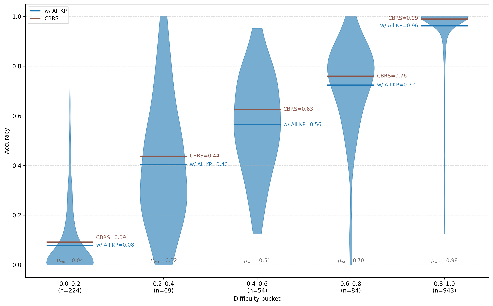
  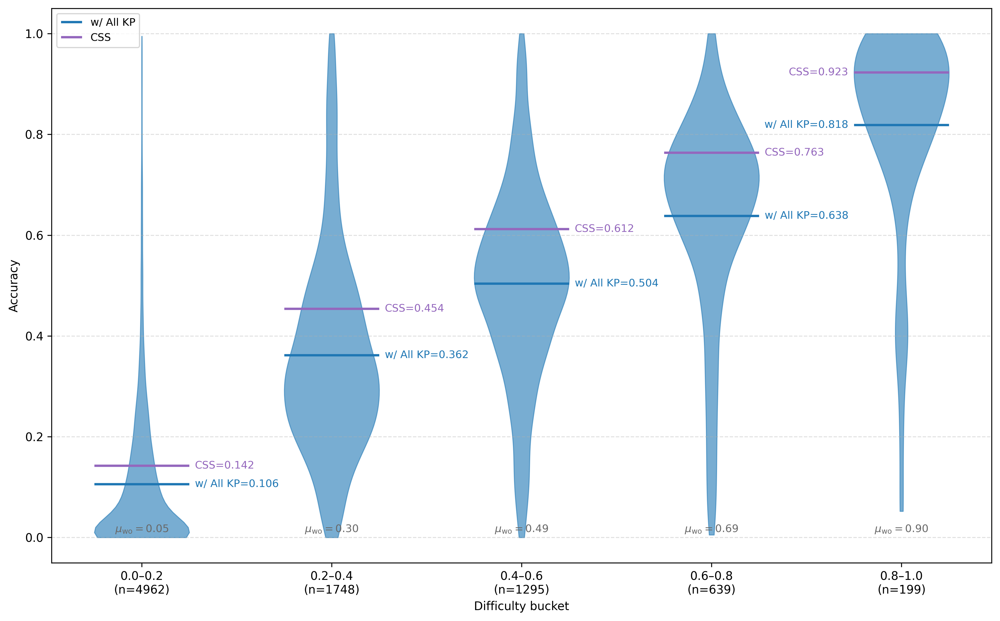
</p>
<p align="center">
  <b>Figure 2.</b> Difficulty-bucket analysis on test set (left) and training set (right). CSS-selected KPs deliver larger and more consistent gains across difficulty levels. Full-KP injection can introduce regressions on certain subsets.
</p>

### Training Dynamics: CSS vs CBRS

<p align="center">
  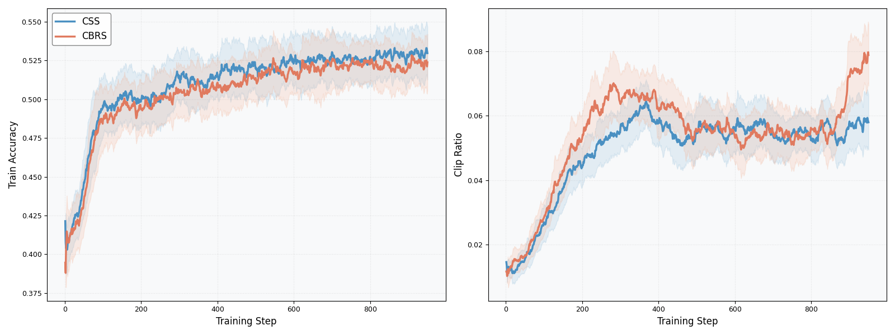
</p>
<p align="center">
  <b>Figure 3.</b> Comparison of KP selection strategies (CSS vs CBRS) under the same training budget. CSS maintains a persistent advantage in training accuracy with more stable policy refinement.
</p>

### Reward Sparsity Reduction

KnowRL training dramatically reduces reward sparsity: the zero-correct fraction drops from **41.21%** to **13.00%**, while the all-correct bucket rises from **1.35%** to **34.28%** (+32.93pp).

<p align="center">
  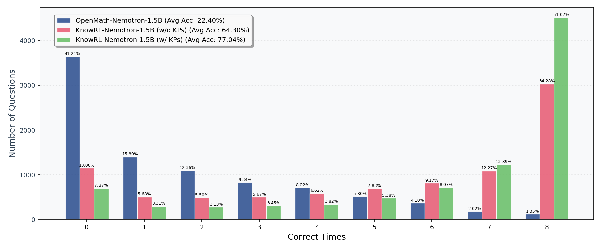
</p>
<p align="center">
  <b>Figure 4.</b> Distribution of per-query correct counts on the training set. KnowRL training (middle) collapses the zero-correct fraction and shifts mass toward all-correct. Adding KP hints at inference (right) further concentrates correctness.
</p>

### Pruning Interaction Paradox

We discover a **pruning interaction paradox**: removing individual "bad" KPs improves accuracy, but removing them jointly can degrade performance due to inter-KP dependencies.

<p align="center">
  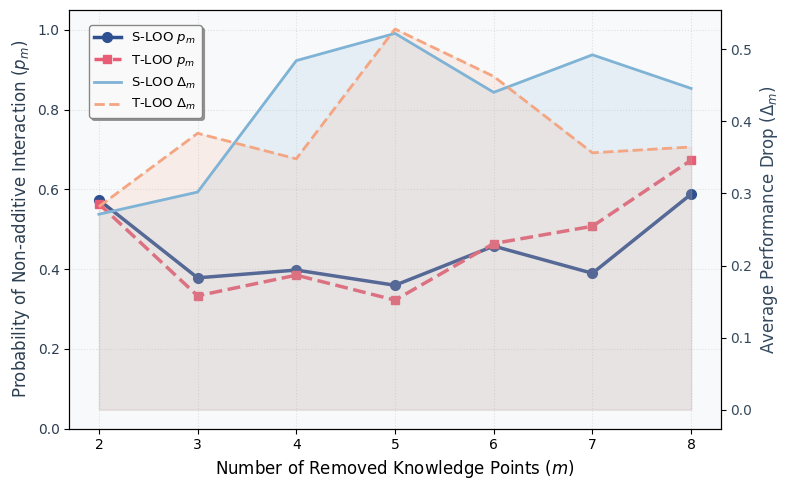
  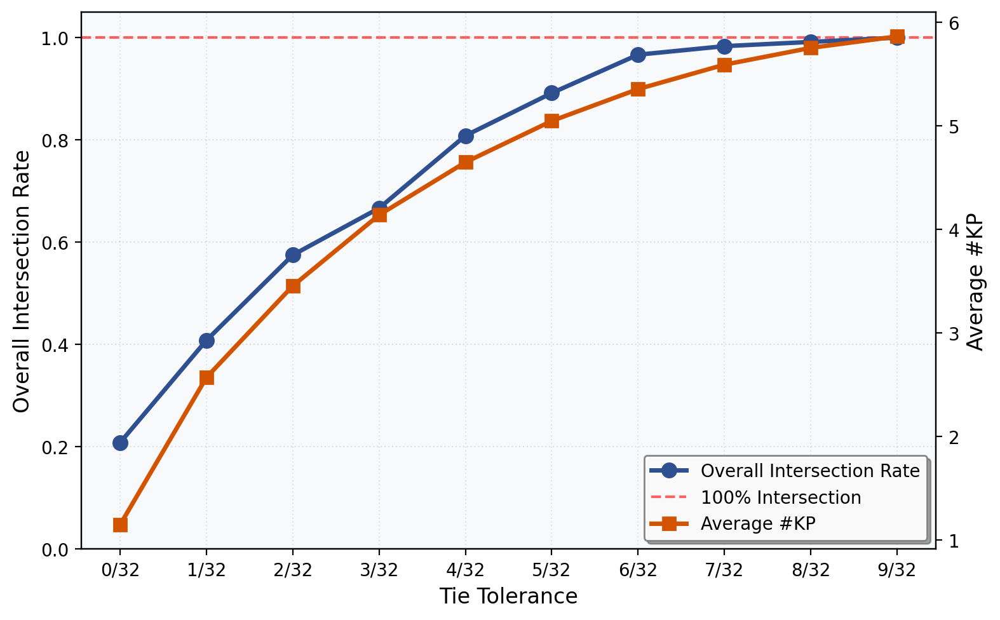
</p>
<p align="center">
  <b>Figure 5.</b> Left: Pruning interaction paradox under LOO-style selection — cross-hint inconsistency occurs in 40%–60% of cases. Right: Tolerance-threshold sensitivity for the delta parameter in CBRS.
</p>

### Critical-Segment Visualization

<p align="center">
  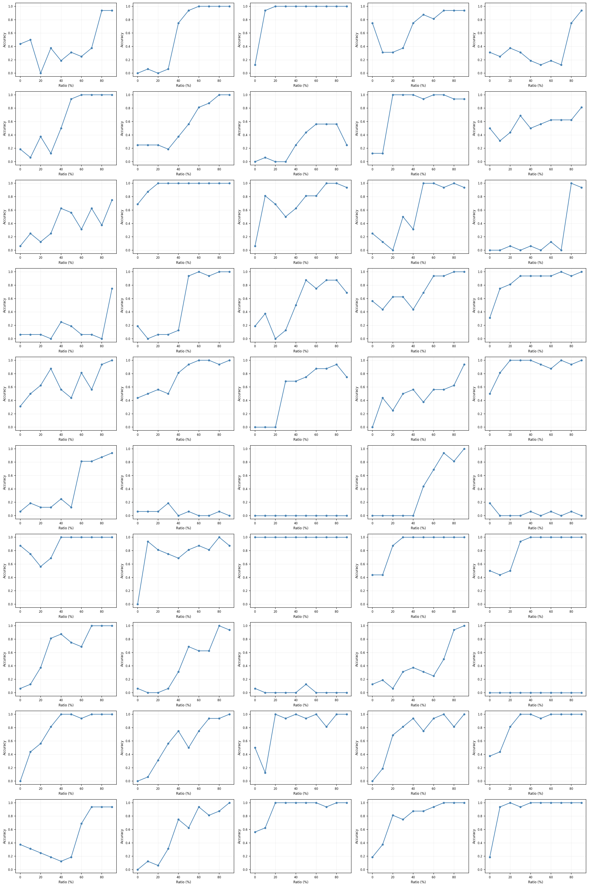
</p>
<p align="center">
  <b>Figure 6.</b> Visualization of the critical-segment effect across prefix ratios on 50 training instances. Performance typically remains flat in low-ratio regions, then exhibits a distinct jump once a key segment is included.
</p>

## 📁 Project Structure

```
KnowRL/
├── README.md
├── setup_env.sh              # One-click environment setup script
├── environment.yml           # Conda environment configuration
├── requirements.txt          # Full pip dependencies for exact reproducibility
│
├── eval/                     # Evaluation pipeline
│   ├── data/                 # Evaluation benchmark datasets
│   │   ├── AIME24/           # AIME 2024
│   │   ├── AIME25/           # AIME 2025
│   │   ├── AMC23/            # AMC 2023
│   │   ├── BRUMO25/          # BRUMO 2025
│   │   ├── CMIMC25/          # CMIMC 2025
│   │   ├── HMMT25/           # HMMT 2025
│   │   ├── MATH_500/         # MATH-500 subset
│   │   └── Olympiad_Bench/   # Olympiad Bench
│   └── eval_scripts/         # Evaluation scripts
│       ├── task.py           # Task definitions (all supported task names)
│       ├── prompts.py        # Prompt templates (with/without KP hints)
│       ├── s1_gen_vllm.py    # Step 1: Generate responses via vLLM
│       ├── s1_gen_vllm.sh    # Step 1: Shell wrapper
│       ├── s2_vllm_serve.sh  # Step 2: Serve judge model (CompassVerifier-3B)
│       ├── rule_base_verl.py # Rule-based answer verification
│       ├── s3_rule_base_verl.sh  # Step 3: Run rule-based evaluation
│       ├── s3_model_base_verl.py # Model-based evaluation (with judge)
│       └── eval_outputs/     # Generated evaluation results
│
├── train/                    # Training pipeline
│   ├── knowrl.sh             # Main training launch script (DAPO/GRPO via Ray)
│   ├── train_data/           # Training data (KP hints embedded in prompts)
│   │   ├── css.jsonl
│   │   └── css.parquet
│   └── val/                  # Validation data used during training
│       ├── aime24/
│       ├── aime25/
│       ├── brumo_2025/
│       └── hmmt_25_2/
│
├── utils/
│   └── ray_start.sh          # Ray cluster initialization for multi-node training
│
├── huggingface/              # Scripts and data for HuggingFace upload
│   ├── hf_upload.py
│   └── train/
│
└── verl/                     # verl framework (RL training library for LLMs)
```

## ✨ Getting Started

### Prerequisites

- Linux (tested on Ubuntu)
- NVIDIA GPU with CUDA 12.4+
- Conda (Miniconda or Anaconda)

### Clone the Repository

```bash
git clone <knowrl_repo_url>
cd KnowRL
```

### Install Dependencies (Choose One)

> **Note**: This step only installs the Python dependencies. verl is installed separately in the next step.

#### Option A: One-click Script (Recommended)

```bash
bash setup_env.sh
conda activate knowrl
```

#### Option B: Conda environment.yml

```bash
conda env create -f environment.yml
conda activate knowrl
```

> **Note**: If pip fails to find `torch`, your pip mirror may not host PyTorch.
> The `environment.yml` includes `--extra-index-url` for the official PyTorch index,
> but if it still fails, use **Option A** or **Option C** instead.

#### Option C: Manual Step-by-Step

```bash
# 1. Create conda env
conda create -n knowrl python=3.10 -y
conda activate knowrl

# 2. Install PyTorch (CUDA 12.4)
pip install torch==2.6.0 torchvision==0.21.0 torchaudio==2.6.0 \
    --extra-index-url https://download.pytorch.org/whl/cu124

# 3. Install all other dependencies
pip install -r requirements.txt --extra-index-url https://pypi.org/simple/

# 4. Install flash-attn (requires compilation)
pip install flash-attn==2.7.4.post1 --no-build-isolation
```

### Install verl

```bash
cd verl
pip install -e . --extra-index-url https://pypi.org/simple/
```

### Verify Installation

```bash
python -c "import torch; print(f'PyTorch {torch.__version__}, CUDA {torch.cuda.is_available()}')"
python -c "import transformers; print(f'Transformers {transformers.__version__}')"
python -c "import vllm; print(f'vLLM {vllm.__version__}')"
python -c "import verl; print('verl OK')"
```

## 📊 Data

### HuggingFace Resources

| Resource | Link |
|----------|------|
| KnowRL Collection | [HasuerYu/knowrl](https://huggingface.co/collections/HasuerYu/knowrl) |
| Training Data | [HasuerYu/KnowRL-Train-Data](https://huggingface.co/datasets/HasuerYu/KnowRL-Train-Data) |
| KP Annotations | [HasuerYu/KnowRL-KP-Annotations](https://huggingface.co/datasets/HasuerYu/KnowRL-KP-Annotations) |
| Model | [HasuerYu/KnowRL-Nemotron-1.5B](https://huggingface.co/HasuerYu/KnowRL-Nemotron-1.5B) |

### Local Data

- **`eval/data/`**: Evaluation data for offline evaluation, consistent with the evaluation data on HuggingFace.

- **`train/train_data/`**: Training-ready data. Knowledge points are directly embedded in the prompt as a `## Hint` section (rather than listed separately). Each record contains `kp_list` (all candidate knowledge points) and `kept_kp_index` (indices of selected knowledge points injected into the prompt). The HuggingFace version provides the complete knowledge points along with those extracted by CSS and CBRS strategies respectively.

- **`train/val/`**: Validation data used during training. Prompts contain only the math problem followed by the suffix `Please reason step by step, and put your final answer within \boxed{}.`, without any knowledge point hints.

## 🏋️ Training

We use the DAPO/GRPO algorithm via [verl](https://github.com/volcengine/verl) with Ray for distributed training.

**Base model**: `nvidia/OpenMath-Nemotron-1.5B`

**Key hyperparameters**:

| Parameter | Value |
|-----------|-------|
| Learning rate | 1e-6 |
| Batch size | 256 |
| Max prompt length | 8192 |
| Max response length | 32768 |
| Rollout engine | vLLM |
| Samples per prompt (train) | 8 |
| Samples per prompt (val) | 32 |
| Total epochs | 150 |
| Total training steps | 2,960 |
| Save / Eval frequency | Every 10 steps |
| Hardware | 8x NVIDIA H100 nodes (64 GPUs) |
| Training time | ~13 days |

### Start Ray Cluster

For **single-node** training, you can skip this step — Ray will be automatically initialized when the training script runs.

For **multi-node** training, start the Ray cluster before launching the training script on each node:

```bash
# On head node
bash utils/ray_start.sh
```

### Launch Training

```bash
bash train/knowrl.sh
```

Training checkpoints will be saved under `checkpoints/`. Validation and rollout data will be saved under `validation_data/` and `rollout_data/` respectively. Training metrics are logged to [WandB](https://wandb.ai/).

### Entropy Annealing

We apply entropy annealing by adjusting the clip upper bound during training. After 2,590 steps, `clip_high` is reduced from 0.28 to 0.26, inducing a faster entropy drop and encouraging the policy to shift from exploration to exploitation.

<p align="center">
  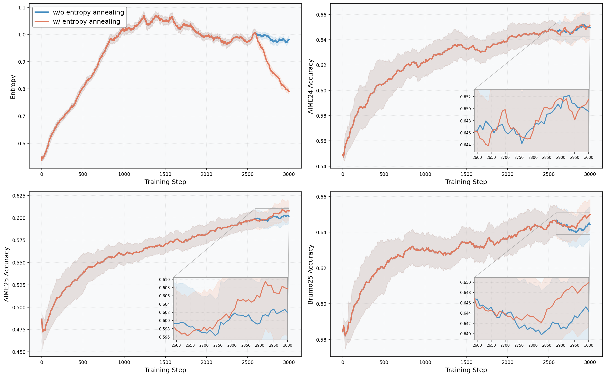
</p>
<p align="center">
  <b>Figure 7.</b> Comparison with and without entropy annealing. Entropy annealing yields faster entropy reduction and consistently better validation performance, contributing +0.74 average accuracy improvement.
</p>

## 📝 Evaluation

The evaluation pipeline consists of three steps: generation, judge model serving, and scoring.

We evaluate on **8 benchmarks** (1,374 problems total): AIME24, AIME25, BRUMO25, HMMT25, AMC23, CMIMC25, MATH-500, and Olympiad-Bench.

### Step 1: Generate Responses

First, check all supported task names in `eval/eval_scripts/task.py`. The available tasks include:

- **Raw** (no KP hints): `AIME24`, `AIME25`, `BRUMO25`, `HMMT25`, `AMC23`, `CMIMC25`, `MATH_500`, `Olympiad_Bench`
- **CBRS** (Consensus-Based Robust Selection): `AIME24_CBRS`, `AIME25_CBRS`, ... (append `_CBRS` suffix)
- **CSS** (Constrained Subset Search): `AIME24_CSS`, `AIME25_CSS`, ... (append `_CSS` suffix)

Then modify `eval/eval_scripts/s1_gen_vllm.sh` to set your model path and task list, and run:

```bash
cd eval/eval_scripts
# Edit s1_gen_vllm.sh to configure your model and tasks
bash s1_gen_vllm.sh
```

Results will be saved under `eval/eval_scripts/eval_outputs/`.

### Step 2: Serve Judge Model

Launch the CompassVerifier-3B as a judge model using vLLM:

```bash
export CUDA_VISIBLE_DEVICES=0
vllm serve <path_to_CompassVerifier-3B> \
    --served-model-name cv_3b \
    --tensor-parallel-size 1 \
    --pipeline-parallel-size 1 \
    --trust-remote-code \
    --port 8000 \
    --host 0.0.0.0
```

### Step 3: Run Evaluation

Run rule-based evaluation on the generated outputs:

```bash
bash eval/eval_scripts/s3_model_base_verl.sh
```

## 📌 Citation

If you find this work helpful, please cite our paper:

```bibtex
@misc{yu2026knowrlboostingllmreasoning,
      title={KnowRL: Boosting LLM Reasoning via Reinforcement Learning with Minimal-Sufficient Knowledge Guidance}, 
      author={Linhao Yu and Tianmeng Yang and Siyu Ding and Renren Jin and Naibin Gu and Xiangzhao Hao and Shuaiyi Nie and Deyi Xiong and Weichong Yin and Yu Sun and Hua Wu},
      year={2026},
      eprint={2604.12627},
      archivePrefix={arXiv},
      primaryClass={cs.AI},
      url={https://arxiv.org/abs/2604.12627}, 
}
```
